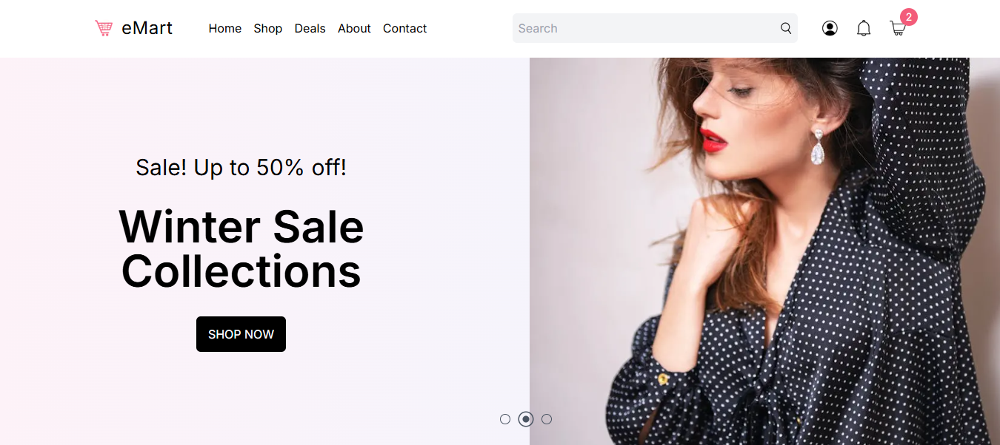

# eMart


eMart is a modern and responsive e-commerce platform built with **Next.js** and **Tailwind CSS**. It provides a seamless shopping experience, allowing users to browse products, add them to their cart, and complete purchases. The app leverages the power of Next.js for server-side rendering (SSR) and static site generation (SSG), ensuring fast performance and SEO optimization.

## Features

- **Product Browsing**: Browse products with categories and filters.
- **Shopping Cart**: Add and remove products from your cart.
- **User Authentication**: Sign up, log in, and manage your account.
- **Secure Checkout**: Complete purchases with a secure payment process.
- **Responsive Design**: Works seamlessly on all devices.
- **SEO Optimization**: Built with Next.js for improved search engine visibility.

## Technologies Used

- **Next.js**: A React framework for server-side rendering and static site generation.
- **Tailwind CSS**: A utility-first CSS framework for rapid UI development.

## Getting Started

### Prerequisites

- Node.js (v16 or higher)
- npm or yarn

### Installation

1. Clone the repository:
   ```bash
   git clone https://github.com/your-username/emart.git
2. Navigate to the project directory:
    ```bash
    cd emart
3. Install dependencies:
    ```bash
    npm install
    # or
    yarn install
4. Start the development server:
    ```bash
    npm start
    # or
    yarn start
5. Open your browser and navigate to http://localhost:3000.

## Deployment
This app is deployed on Vercel. To deploy your own version:

1. Fork this repository.
2. Connect your GitHub account to Vercel.
3. Import the repository into Vercel.
4. Add the required environment variables in the Vercel dashboard.
5. Deploy your app.

## Usage

1. Browse Products: Use the search bar and filters to find products.
2. Add to Cart: Click the "Add to Cart" button on any product.
3. View Cart: Navigate to the cart page to view and manage your items.
4. Persistent Cart: Your cart data will persist even after refreshing the page.

## Screenshots

 
 

## Contributing

Contributions are welcome! If you'd like to contribute, please follow these steps:

1. Fork the repository.
2. Create a new branch (git checkout -b feature/YourFeatureName).
3. Commit your changes (git commit -m 'Add some feature').
4. Push to the branch (git push origin feature/YourFeatureName).
5. Open a pull request.

## License

This project does not currently have a license. Please contact the repository owner for more information.

## 📞 Contact
If you have any questions or feedback, feel free to reach out:

- Md. Shamim Hossain
- Email: shamimthedev@gmail.com
- GitHub: shamimthedev
- Portfolio: shamimthedev.vercel.app

### Made with ❤️ by Md. Shamim Hossain